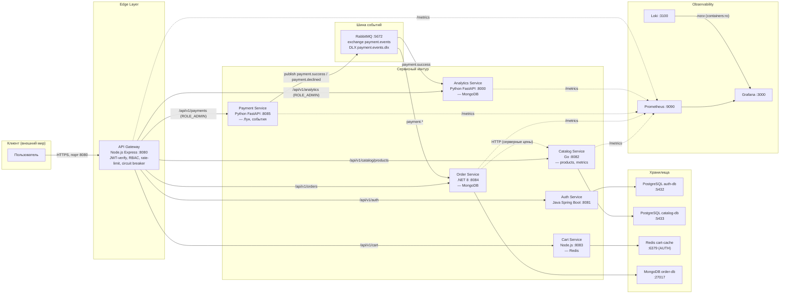
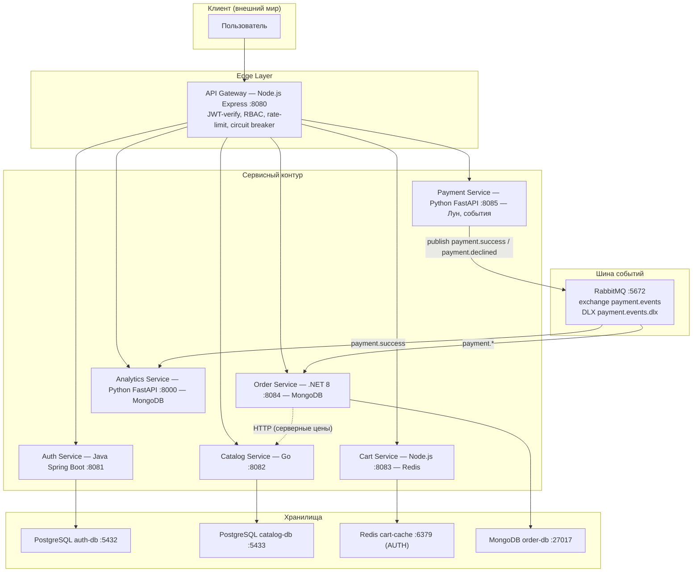

# Архитектурный паспорт платформы E-Commerce (Полиглотный микросервисный контур)

> Документ описывает фактическое состояние репозитория `docker-project` после
> аудита безопасности и интеграции (ветка `project`, сентябрь 2026).
> Источник истины — код, docker-compose и Helm-чарты; все схемы сверены с реализацией.

## 1. Спецификация глобальной топологии микросервисов

Платформа представляет собой полиглотную событийно-ориентированную систему:
шесть сервисов объединены синхронным HTTP-проксированием через API Gateway
и асинхронной шиной AMQP (RabbitMQ). Развёртывание — docker-compose
(локальная разработка) и Helm/K3s (продакшн-контур), сетевая изоляция —
NetworkPolicy (входящий трафик разрешён только от API Gateway).

### Схема распределения рантаймов и портов (внутренние порты контейнеров)

| Сервис | Рантайм / фреймворк | Внутр. порт | Хранилище | Зона ответственности |
|---|---|---|---|---|
| **API Gateway** | Node.js 20 / Express | `8080` | — | Единая точка входа: JWT-верификация, RBAC, rate-limit, circuit breaker, `/metrics` |
| **Auth Service** | Java 21 / Spring Boot | `8081` | PostgreSQL (`auth-db`) | Генерация/проверка RSA-ключей, выпуск и валидация JWT |
| **Catalog Service** | Go 1.22 | `8082` | PostgreSQL (`catalog-db`) | REST-каталог товаров, `/metrics`, `/health` |
| **Cart Service** | Node.js / Express | `8083` | Redis (`cart-cache`) | Корзина покупателя, валидация quantity/price |
| **Order Service** | .NET 8 / ASP.NET Core | `8084` | MongoDB (`order-db`) | Создание заказов, серверные цены из каталога, консьюмер статусов платежа |
| **Payment Service** | Python 3.11 / FastAPI | `8085` | PostgreSQL (SQLAlchemy) | Валидация карт (алгоритм Луна), публикация событий платежей |
| **Analytics Service** | Python 3.11 / FastAPI | `8000` (внешний `8086`) | MongoDB (`analytics_db`) | Аггрегация аналитики, консьюмер успешных платежей |

### Внешняя экспозиция (только loopback `127.0.0.1`)

| Компонент | Порт на хосте | Примечание |
|---|---|---|
| API Gateway | `${GATEWAY_PORT}` (по умолч. `8080`) | единственный входной шлюз |
| Auth Service | `${AUTH_SERVICE_PORT}` = `8081` | loopback |
| Catalog Service | `${CATALOG_SERVICE_PORT}` = `8082` | loopback |
| Cart Service | `${CART_SERVICE_PORT}` = `8083` | loopback |
| Order Service | `${ORDER_SERVICE_PORT}` = `8084` | loopback |
| Payment Service | `${PAYMENT_SERVICE_PORT}` = `8085` | loopback |
| Analytics Service | `8086` | loopback |
| PostgreSQL (auth/catalog) | `5432` / `5433` | loopback, healthcheck `pg_isready` |
| Redis | `6379` | loopback, только с `--requirepass` |
| MongoDB | `27017` | loopback, root-учётка |
| RabbitMQ AMQP / Management | `5672` / `${RABBITMQ_MANAGEMENT_PORT}` | loopback |
| Prometheus / Grafana | `9090` / `${GRAFANA_PORT}` | Grafana — loopback + пароль админа |
| Loki / Promtail | `3100` | loopback |

### Диаграмма топологии (Mermaid)



### Вертикальная диаграмма топологии (сверху вниз)



---

## 2. Спецификация аутентификации и авторизации (JWT + RBAC)

### Ключевой контур
1. **Auth Service** загружает **RSA-4096** пару ключей из `configs/private.pem` /
   `public.pem`, подписывает JWT. Публичный ключ монтируется в контейнер
   **Order Service** и **API Gateway** (`public.pem`, read-only).
2. **API Gateway** — единая точка проверки токенов:
   - `/api/v1/cart` — `verifyToken()` (достаточно валидного JWT);
   - `/api/v1/orders` — `verifyToken()` через fallback-маршрут;
   - `/api/v1/payments` — `verifyToken('ROLE_ADMIN')`;
   - `/api/v1/analytics` — `verifyToken('ROLE_ADMIN')`.
3. **Order Service** аутентифицирует напрямую (JWT Bearer, RSA public key,
   `NameClaimType=sub`, `RoleClaimType=role`, issuer `ecommerce-platform`):
   идентификация пользователя берётся из claim `sub`, а не из заголовков.

### Требования безопасности
- Все секреты — строго через переменные окружения (`.env`); в коде паролей нет
  (defaults сброшены, подключения к БД бросают исключение при отсутствии env).
- Rate-limit на `/api/v1/auth`: **10 попыток / 5 минут** (express-rate-limit).
- Хранилища слушают только `127.0.0.1`; Redis — `AUTH` обязателен.
- CI: job `security-scan` (gitleaks + grep) блокирует утечку ключей/паролей.
- Helm: `securityContext` non-root, NetworkPolicy (ingress — только от api-gateway).

---

## 3. Событийно-ориентированный контур платежей (топология RabbitMQ)

Единый контракт: **exchange `payment.events`** типа `topic`, durable.

### Карта exchange, очередей и маршрутизации

| Объект | Тип | Назначение |
|---|---|---|
| Exchange `payment.events` | `topic`, durable | Единая шина событий платежей |
| Routing key `payment.success` | — | Платёж прошёл (валидная карта по Луну) |
| Routing key `payment.declined` | — | Платёж отклонён (невалидная карта/битые данные) |
| Очередь `orders.analytics` | binding `payment.success` | Analytics Service агрегирует успешные продажи |
| Очередь `orders.payment_statuses` | binding `payment.*` | Order Service обновляет статус заказа |
| Exchange `payment.events.dlx` | `fanout`, durable | Dead-Letter Exchange (битые сообщения) |
| Очередь `orders.analytics.dlq` | — | Кладбище битых событий аналитики |
| Очередь `orders.payment_statuses.dlq` | — | Кладбище битых событий заказов |

### Регламент доставки и контракт сообщения
- **Payload события:** `{ "orderId": "...", "status": "success|declined", "amount": <число> }`.
- **Идемпотентность:** Payment Service повторные попытки по `orderId` не дублируют;
  Order Service использует `SemaphoreSlim` для сериализации обработки.
- **Ack-политика:** подтверждение (`basic_ack`) — только после успешной обработки;
  при ошибке парсинга — `basic_nack(requeue=false)` → сообщение уходит в DLQ,
  не зацикливается в очереди.
- **Доступность брокера:** при недоступности RabbitMQ консьюмеры перезапускаются
  с экспоненциальной паузой; Payment Service возвращает `503`.

### Поток событий платежа (Mermaid)

```mermaid
sequenceDiagram
    autonumber
    participant GW as API Gateway
    participant PAY as Payment Service
    participant RMQ as RabbitMQ<br/>payment.events (topic)
    participant ORD as Order Service
    participant AN as Analytics Service
    participant DLX as DLX payment.events.dlx

    GW->>PAY: POST /api/v1/payments (JWT ROLE_ADMIN) + карта
    alt Карта валидна (длина 16, алгоритм Луна)
        PAY->>RMQ: publish payment.success {orderId, status, amount}
        RMQ-->>ORD: route payment.* → orders.payment_statuses
        RMQ-->>AN: route payment.success → orders.analytics
        ORD->>ORD: Order.Status = "Paid" (MongoDB)
        AN->>AN: сумма += amount, счётчики++
    else Карта отклонена или данные битые
        PAY->>RMQ: publish payment.declined {orderId, status, amount}
        RMQ-->>ORD: route payment.* → orders.payment_statuses
        ORD->>ORD: заказ не подтверждается
    end
    Note over ORD: ack только после успешной записи;<br/>ошибка → nack(requeue=false) → DLQ
    ORD-->DLX: битое сообщение → orders.payment_statuses.dlq
    AN-->DLX: битое сообщение → orders.analytics.dlq
```

---

## 4. Жизненный цикл заказа и компенсация (Eventual Consistency)

1. **POST /api/v1/orders** (Order Service) → проверка JWT, валидация `Quantity > 0`,
   **цены берутся только с Catalog Service** (серверные, не из тела запроса),
   заказ сохраняется в MongoDB со статусом **`PendingPayment`**.
   Если каталог недоступен — ответ `503`, деньги/заказ не создаются.
2. **POST /api/v1/payments** (через Gateway, только `ROLE_ADMIN`) → Payment Service
   валидирует карту (длина 16, алгоритм Луна), при успехе публикует
   `payment.success`, при отказе — `payment.declined`.
3. **Order Service** (консьюмер `orders.payment_statuses`):
   - `payment.success` → статус заказа **`Paid`** (MongoDB),
   - `payment.declined` → статус остаётся/переводится в отклонённое состояние —
     заказ не подтверждается.
4. **Analytics Service** (консьюмер `orders.analytics`) накапливает
   `sales_volume_usd`, `total_processed_transactions`, `recent_paid_orders`
   (потокобезопасно через lock) и отдаёт сводку по `GET /api/v1/analytics/summary`.

> Реестр компенсирующих действий для полной Saga (возврат остатков каталога,
> отмена резервирования) в текущей ветке **не реализован** — контур каталога
> остаётся синхронным (REST). Расширение до оркестратора (exchange
> `saga.order.events`, компенсация `stock.reservation.failed`) находится
> в ветке `origin/feature-saga-tracing`.

---

## 5. Инфраструктурный регламент и обслуживание (Ops)

- **Многоэтапные Dockerfile** без инструментов хост-машины; node-контейнеры
  выполняются от непривилегированного пользователя (`USER node`).
- **Оркестрация:** docker-compose для dev; Helm-чарты для всех 7 сервисов
  (`infrastructure/kubernetes/helm-charts/<service>/`) с реальными образами
  `ghcr.io/gansganrnett/docker-project/<service>:latest`, probes, resources,
  securityContext; базовые манифесты БД — `infrastructure/kubernetes/base/`.
- **Мониторинг:** каждый сервис публикует `/metrics` (Prometheus text format);
  targets описаны в `monitoring/prometheus/prometheus.yml`; сбор логов — Loki +
  Promtail (только чтение docker.sock и `/var/lib/docker/containers:ro`).
- **Безопасность поставки:** `.gitignore` блокирует `*.pem`, `*.log`, `target/`,
  `.env`; образцы конфигурации — в `.env.example`. Старые ключи из истории git
  требуют очистки через `git filter-repo` (ручной шаг) и перевыпуска JWT.
- **CI/CD:** build-матрица, `security-scan` (gitleaks), `run-tests`
  (Go `go test`, Python `pytest`, .NET `dotnet build`), линтеры.
- **Проверка готовности:** `scripts/check-dbs.sh` — `pg_isready`, `mongosh ping`,
  `redis-cli AUTH`+`PING`, `rabbitmq-diagnostics check_running`.

---

## 6. Известные расхождения и отложенные задачи

1. **Сквозная трассировка `X-Correlation-ID` отсутствует** в текущем коде
   (заголовок генерировался в saga-ветке; в `project`/`main` не внедрён).
   Перед добавлением требуется синхронизация с `feature-saga-tracing`.
2. **Payment/Analytics БД** объявлены в коде (SQLAlchemy `PAYMENT_DATABASE_URL`,
   MongoDB `ANALYTICS_MONGO_URL`), но в docker-compose отсутствуют выделенные
   инстансы — контейнеры работают без персистентности платежей/аналитики.
3. **Root-пользователь** в Dockerfile'ах Python/.NET сервисов — не используется
   `USER` (в отличие от node-сервисов).
4. **Идемпотентность платежей** реализована in-memory (не переживает рестарт);
   для продакшена требуется Redis/БД.